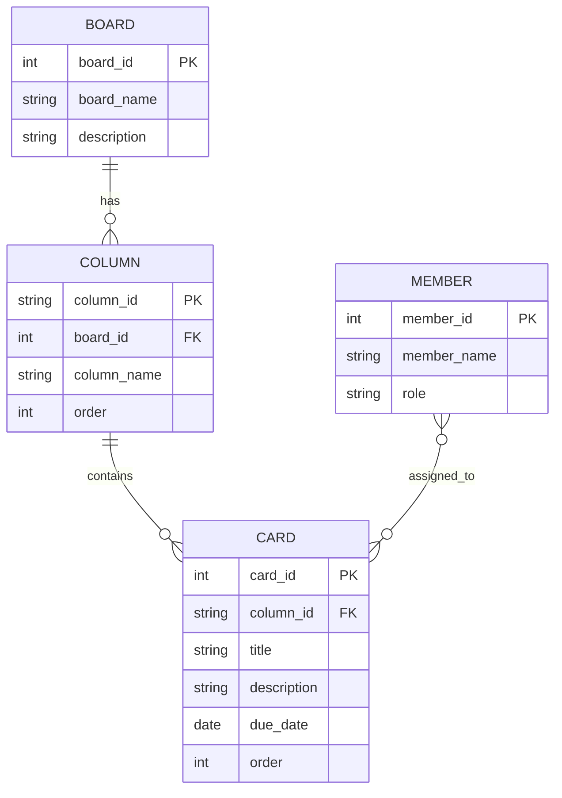

# 봄동비빔밥 만들기 - 개념모델 ERD 매핑

## 1. 엔티티 정의

### Board (보드)
- **board_id**: 1
- **board_name**: 봄동비빔밥 만들기
- **description**: 봄동비빔밥 조리 과정을 칸반으로 관리하는 프로젝트 보드 (개념모델 ERD 기반)

---

## 2. Column (상태 열) 정의

| column_id | column_name | order | 설명 |
|-----------|-------------|-------|------|
| preparation | 재료 손질 및 준비 | 1 | 조리 전 준비 단계 |
| cooking_in_progress | 조리 진행 중 | 2 | 실제 조리 진행 단계 |
| ready_to_serve | 담기 준비 완료 | 3 | 비빔 직전 준비 완료 |
| completed | 완료 | 4 | 최종 완료 상태 |

---

## 3. Card (작업 카드) 정의

### Preparation (재료 손질 및 준비)
| card_id | GitHub Issue | Title | Description | Due Date | Order |
|---------|-------------|-------|-------------|----------|-------|
| 1 | #28 | 봄동 씻기 | 흐르는 물에 봄동을 세척한다 | 2026-04-05 | 1 |
| 2 | #29 | 봄동 썰기 | 먹기 좋은 크기로 자른다 | 2026-04-05 | 2 |
| 3 | #30 | 고추장/참기름/깨 준비 | 양념 재료를 미리 꺼내 놓는다 | 2026-04-05 | 3 |
| 4 | #31 | 그릇/수저 세팅 | 먹기 전 식기 세팅을 완료한다 | 2026-04-05 | 4 |

### Cooking (조리 진행 중)
| card_id | GitHub Issue | Title | Description | Due Date | Order |
|---------|-------------|-------|-------------|----------|-------|
| 5 | #32 | 버섯 볶기 | 기름을 두르고 버섯을 볶는다 | 2026-04-05 | 1 |
| 6 | #33 | 콩나물 데치기 | 콩나물을 짧게 데쳐 식감을 맞춘다 | 2026-04-05 | 2 |
| 7 | #34 | 계란 프라이 | 반숙 또는 완숙으로 조리한다 | 2026-04-05 | 3 |
| 8 | #35 | 밥 데우기 | 따뜻한 상태로 준비한다 | 2026-04-05 | 4 |

### Ready to Serve (담기 준비 완료)
| card_id | GitHub Issue | Title | Description | Due Date | Order |
|---------|-------------|-------|-------------|----------|-------|
| 9 | #36 | 밥 1공기 준비됨 | 그릇에 밥을 담아 둔다 | 2026-04-05 | 1 |
| 10 | #37 | 당근 채썰기 완료 | 고명용 당근 준비 완료 상태 | 2026-04-05 | 2 |
| 11 | #38 | 고명 배치 순서 점검 | 봄동-나물-버섯-계란 순서 점검 | 2026-04-05 | 3 |
| 12 | #39 | 비벼 먹기 직전 상태 | 양념만 넣으면 바로 식사 가능 | 2026-04-05 | 4 |

### Completed (완료)
| card_id | GitHub Issue | Title | Description | Due Date | Order |
|---------|-------------|-------|-------------|----------|-------|
| 13 | #40 | 냉장고 재료 확인 완료 | 재료 보유 여부 점검 완료 | 2026-04-05 | 1 |
| 14 | #41 | 봄동 손질 완료 | 씻기/썰기 마무리 상태 | 2026-04-05 | 2 |
| 15 | #42 | 기본 플레이팅 완료 | 주요 고명 배치 완료 상태 | 2026-04-05 | 3 |
| 16 | #43 | 다음 개선 포인트 기록 | 다음 조리 때 개선점을 남김 | 2026-04-05 | 4 |

---

## 4. Member (담당자) 정의

| member_id | member_name | Role | Assigned Cards |
|-----------|------------|------|-----------------|
| 1 | 나 | Chef/Coordinator | 모든 카드 |
| 2 | 팀원1 | Assistant | 선택적 |
| 3 | 팀원2 | Assistant | 선택적 |

---

## 5. 관계 (Relationships)

### Board 1:N Column
```
Board (1)
├─ preparation (N)
├─ cooking_in_progress (N)
├─ ready_to_serve (N)
└─ completed (N)
```

### Column 1:N Card
```
preparation (1:4)
├─ #28: 봄동 씻기
├─ #29: 봄동 썰기
├─ #30: 고추장/참기름/깨 준비
└─ #31: 그릇/수저 세팅

cooking_in_progress (1:4)
├─ #32: 버섯 볶기
├─ #33: 콩나물 데치기
├─ #34: 계란 프라이
└─ #35: 밥 데우기

ready_to_serve (1:4)
├─ #36: 밥 1공기 준비됨
├─ #37: 당근 채썰기 완료
├─ #38: 고명 배치 순서 점검
└─ #39: 비벼 먹기 직전 상태

completed (1:4)
├─ #40: 냉장고 재료 확인 완료
├─ #41: 봄동 손질 완료
├─ #42: 기본 플레이팅 완료
└─ #43: 다음 개선 포인트 기록
```

### Member N:M Card (협업 캐릭터)
```
나 (member_id: 1)
├─ #28 - #43 (모든 16개 카드 담당)

팀원1 (member_id: 2) - Optional
└─ #32, #33, #34, #35 (조리 담당)

팀원2 (member_id: 3) - Optional
└─ #36, #37, #38, #39 (담기 담당)
```

---

## 6. 개념모델 ERD (Mermaid)



---

## 7. GitHub Issues와의 매핑

현재 GitHub의 구조:
- **Repository**: itsjustcozyboy/Database
- **Issues**: 16개 (#28~#43)
- **Labels**: 4개 (preparation, cooking, ready, completed)

### Issue Structure
```yaml
Issue #28:
  Title: 봄동 씻기
  Label: preparation
  Body:
    card_id: 1
    column_id: preparation
    column_name: 재료 손질 및 준비
    due_date: 2026-04-05
    order: 1
  Description: 흐르는 물에 봄동을 세척한다
```

---

## 8. Supabase 테이블과의 동기화

### kanban_board
```sql
SELECT * FROM kanban_board 
WHERE source_url = 'https://github.com/users/itsjustcozyboy/projects/2';
-- Result: board_id=1, board_name='봄동비빔밥 만들기'
```

### kanban_column
```sql
SELECT * FROM kanban_column 
WHERE board_id = 1 
ORDER BY position;
-- Results:
-- preparation | 재료 손질 및 준비 | position=1
-- cooking_in_progress | 조리 진행 중 | position=2
-- ready_to_serve | 담기 준비 완료 | position=3
-- completed | 완료 | position=4
```

### kanban_card
```sql
SELECT * FROM kanban_card 
WHERE board_id = 1 
ORDER BY column_id, position;
-- Results: 16 cards mapped to columns
```

---

## 9. ERD를 만들기 위한 체크리스트

✅ **엔티티 정의**: Board, Column, Card, Member  
✅ **속성 정의**: card_id, column_id, title, description, due_date, order  
✅ **관계 정의**: 1:N (Board-Column, Column-Card), N:M (Member-Card)  
✅ **데이터 매핑**: GitHub Issues ↔ Conceptual Model  
✅ **Supabase 연동**: 물리모델 테이블 생성됨  

---

## 10. 다음 단계

1. **GitHub Project 보드에서 Board 뷰 활성화**
   - Column을 상태별로 그룹화
   - Cards를 드래그 앤 드롭으로 이동

2. **Assignee 설정**
   - GitHub에서 각 issue에 담당자 지정
   - Member와 연결

3. **Custom Fields 추가** (Optional)
   - Due date
   - Priority
   - Effort estimate

4. **발표용 ERD 작성**
   - Lucidchart, Draw.io, Mermaid로 공식 ERD 생성
   - README에 포함
