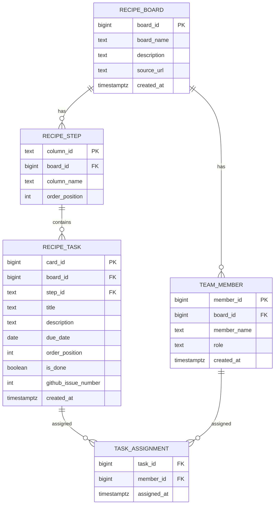

# 봄동비빔밥 칸반 프로젝트 (Supabase ERD)

## 프로젝트 한눈에 보기
이 프로젝트는 봄동비빔밥 조리 과정을 칸반 방식으로 관리합니다.
칸반 개념모델(BOARD, COLUMN, CARD, MEMBER)을 Supabase 물리 스키마로 구현했습니다.

## 왜 ERD 구조가 이렇게 나왔나
이 ERD는 칸반의 핵심 흐름을 그대로 데이터로 옮긴 구조입니다.

1. 보드 하나에서 작업이 관리된다.
2. 작업은 단계(COLUMN)를 따라 이동한다.
3. 실제 할 일은 카드(CARD) 단위로 쪼갠다.
4. 사람(MEMBER)에게 카드를 할당한다.
5. 한 사람이 여러 카드, 한 카드에 여러 사람이 가능하므로 N:M 할당 테이블이 필요하다.

즉, 흐름은 아래와 같습니다.

- BOARD -> COLUMN -> CARD
- MEMBER <-> CARD (via TASK_ASSIGNMENT)

## 개념모델 이름과 실제 Supabase 테이블 매핑
| 개념모델 | 실제 테이블 |
|---|---|
| BOARD | recipe_board |
| COLUMN | recipe_step |
| CARD | recipe_task |
| MEMBER | team_member |
| MEMBER-CARD 할당 | task_assignment |

## 논리 관계도 (Mermaid)


## 테이블별 의미

### 1) recipe_board (BOARD)
프로젝트의 최상위 단위입니다.
- 무엇을 관리하는 보드인지 정의합니다.
- 현재 예시: 봄동비빔밥 만들기 보드 1개.

### 2) recipe_step (COLUMN)
보드 안의 진행 단계(상태)입니다.
- 예: preparation, cooking_in_progress, ready_to_serve, completed
- 카드가 현재 어느 상태인지 결정합니다.
- `order_position`으로 보드 표시 순서를 제어합니다.

### 3) recipe_task (CARD)
실행할 개별 작업입니다.
- 제목, 설명, 마감일, 완료 여부를 가집니다.
- `step_id`로 어떤 단계에 있는지 연결됩니다.
- GitHub Issue 번호(`github_issue_number`)와도 연결됩니다.

### 4) team_member (MEMBER)
작업 담당자 정보입니다.
- 멤버 이름과 역할을 관리합니다.
- 현재 보드 기준 3명: 김정환, 김소윤, 김채우.

### 5) task_assignment (MEMBER-CARD 연결)
멤버와 카드의 다대다(N:M) 관계를 저장합니다.
- 한 멤버가 여러 작업 담당 가능
- 한 작업에 여러 멤버 할당 가능
- 복합 키(`task_id`, `member_id`)로 중복 할당을 방지합니다.

## 테이블 간 관계 정리

1. recipe_board (1) -> recipe_step (N)
보드 하나에 여러 단계가 있습니다.

2. recipe_step (1) -> recipe_task (N)
단계 하나에 여러 작업 카드가 있습니다.

3. recipe_board (1) -> team_member (N)
보드 하나에 여러 팀원이 속합니다.

4. recipe_task (N) <-> team_member (N) via task_assignment
작업과 담당자는 다대다 관계입니다.

## 현재 데이터 기준 해석
- 보드: 1개
- 단계: 4개
- 작업: 16개
- 멤버: 3명
- 할당: 16개(중복 없는 분배)

## 핵심 요약
이 ERD는 "칸반 운영에 필요한 최소 구조"를 유지하면서,
GitHub 이슈 연동과 역할 분담까지 가능한 형태로 확장한 모델입니다.

## ChatGPT 연동 자동 입력 시스템
ChatGPT가 자연어 요청을 해석하고 Supabase에 데이터를 자동 추가/할당하도록 구성했습니다.

### 동작 방식
1. 입력 문장 수신 (예: "조리 단계에 두부 굽기 카드 추가하고 김소윤에게 할당")
2. ChatGPT가 JSON 작업 계획으로 변환
3. 서버가 계획을 검증 후 Supabase에 반영

### 준비
1. `.env.local`에 Supabase 키와 ChatGPT API 키 추가
   ```bash
   OPENAI_API_KEY=sk-your-api-key-here
   ```
2. OpenAI API 계정 및 API 키 준비

### 실행
```bash
# 서버 모드 (HTTP)
npm run openclaw:server

# 단건 실행 (CLI)
npm run openclaw:ingest -- "조리 단계에 두부 굽기 작업 추가하고 김소윤에게 할당"

# DB 반영 없이 계획만 확인
npm run openclaw:ingest -- "완료 단계에 기록 카드 추가" --dry-run
```

### HTTP API 예시
```bash
curl -X POST http://localhost:8787/ingest \
  -H "Content-Type: application/json" \
  -d '{
    "text": "준비 단계에 참기름 확인 카드 추가하고 김정환에게 할당",
    "board_id": 1,
    "dry_run": false
  }'
```

### 지원 작업 타입
- `create_task`: 작업 카드 생성
- `assign_member`: 기존 작업에 담당자 할당
- `create_member`: 신규 팀원 생성

### 자연어 예시
```
- "준비 단계에 봄동씻기 카드 추가"
- "조리 단계에 두부 굽기 추가하고 김소윤에게 할당"
- "담기 준비 단계에 플레이팅 체크 추가. 마감은 내일"
- "김채우를 팀에 추가해줘"
- "버섯 볶기 작업을 김정환에게 할당"
```

관련 파일:
- `src/openclaw-agent.cjs`
- `src/openclaw-server.cjs`
- `src/openclaw-cli.cjs`
