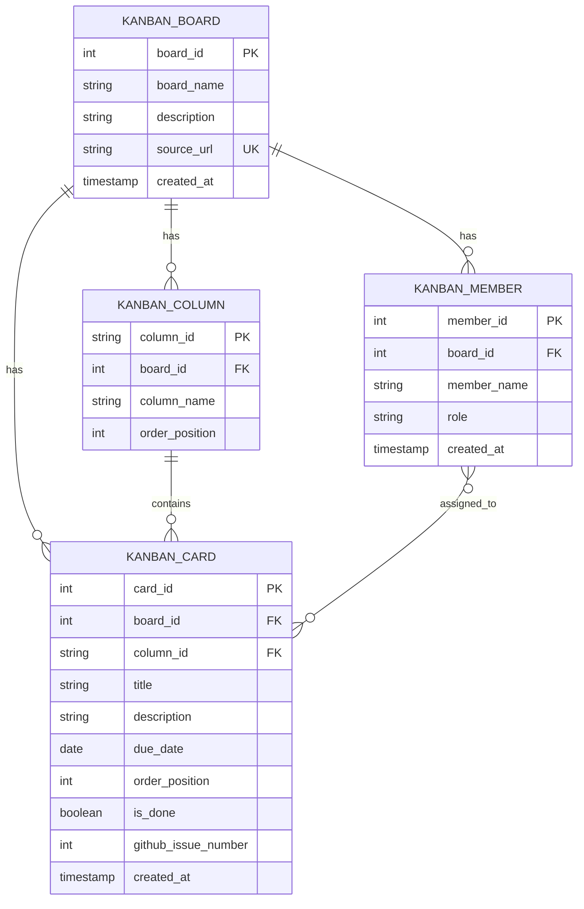

# Supabase 스키마 업데이트 완료

## ✅ 완료 사항

### 1. 기존 데이터 정리
- ✅ 모든 기존 테이블 삭제 (CASCADE 포함)
- ✅ 기존 마이그레이션 히스토리 복구
- ✅ 원격 Supabase 동기화

### 2. 새로운 완전한 스키마 생성
마이그레이션 파일: `010_cleanup_and_rebuild_complete_schema.sql`

#### 생성된 테이블
```
kanban_board ──┬→ kanban_column
               ├→ kanban_member
               └→ kanban_card
                     │
                     └→ kanban_card_member (N:M) ←── kanban_member
```

---

## 📊 테이블 구조

### 1. kanban_board
| 컬럼 | 타입 | 설명 |
|------|------|------|
| board_id | BIGINT PK | 보드 고유 ID (자동증가) |
| board_name | TEXT | 보드 이름 |
| description | TEXT | 보드 설명 |
| source_url | TEXT UNIQUE | GitHub 보드 URL |
| created_at | TIMESTAMPTZ | 생성 시간 |

**샘플 데이터:**
```
board_id=1
board_name='봄동비빔밥 만들기'
source_url='https://github.com/users/itsjustcozyboy/projects/2'
```

### 2. kanban_column
| 컬럼 | 타입 | 설명 |
|------|------|------|
| column_id | TEXT PK | 열 ID (preparation, cooking_in_progress, ready_to_serve, completed) |
| board_id | BIGINT FK | 보드 참조 |
| column_name | TEXT | 열 이름 (한글) |
| order_position | INT UNIQUE | 좌→우 순서 |

**생성된 열:**
```
1. preparation → 재료 손질 및 준비
2. cooking_in_progress → 조리 진행 중
3. ready_to_serve → 담기 준비 완료
4. completed → 완료
```

### 3. kanban_member
| 컬럼 | 타입 | 설명 |
|------|------|------|
| member_id | BIGINT PK | 멤버 고유 ID (자동증가) |
| board_id | BIGINT FK | 보드 참조 |
| member_name | TEXT | 멤버 이름 |
| role | TEXT | 역할 (Chef, Assistant) |
| created_at | TIMESTAMPTZ | 추가 시간 |

**생성된 멤버:**
```
member_id=1 → 나 (Chef)
member_id=2 → 팀원1 (Assistant)
member_id=3 → 팀원2 (Assistant)
```

### 4. kanban_card
| 컬럼 | 타입 | 설명 |
|------|------|------|
| card_id | BIGINT PK | 카드 고유 ID (자동증가) |
| board_id | BIGINT FK | 보드 참조 |
| column_id | TEXT FK | 열 참조 |
| title | TEXT | 카드 제목 |
| description | TEXT | 카드 설명 |
| due_date | DATE | 마감일 |
| order_position | INT | 열 내 순서 |
| is_done | BOOLEAN | 완료 여부 |
| github_issue_number | INT | GitHub 이슈 번호 |
| created_at | TIMESTAMPTZ | 생성 시간 |

**생성된 카드 (16개):**
```
Preparation (4개):
  1. 봄동 씻기 (#28)
  2. 봄동 썰기 (#29)
  3. 고추장/참기름/깨 준비 (#30)
  4. 그릇/수저 세팅 (#31)

Cooking (4개):
  5. 버섯 볶기 (#32)
  6. 콩나물 데치기 (#33)
  7. 계란 프라이 (#34)
  8. 밥 데우기 (#35)

Ready to Serve (4개):
  9. 밥 1공기 준비됨 (#36)
  10. 당근 채썰기 완료 (#37)
  11. 고명 배치 순서 점검 (#38)
  12. 비벼 먹기 직전 상태 (#39)

Completed (4개):
  13. 냉장고 재료 확인 완료 (#40)
  14. 봄동 손질 완료 (#41)
  15. 기본 플레이팅 완료 (#42)
  16. 다음 개선 포인트 기록 (#43)
```

### 5. kanban_card_member (N:M 관계)
| 컬럼 | 타입 | 설명 |
|------|------|------|
| card_id | BIGINT FK PK | 카드 참조 |
| member_id | BIGINT FK PK | 멤버 참조 |
| assigned_at | TIMESTAMPTZ | 지정 시간 |

**생성된 관계:**
```
- 모든 16개 카드 → 멤버1 (나)
- 조리 4개 카드 → 멤버2 (팀원1)
- 담기 4개 카드 → 멤버3 (팀원2)
```

---

## 🔍 검증 쿼리 (Supabase Studio에서 실행)

### 보드 확인
```sql
SELECT * FROM kanban_board;
```

### 열 확인
```sql
SELECT * FROM kanban_column 
WHERE board_id = 1 
ORDER BY order_position;
```

### 카드 확인
```sql
SELECT k.card_id, k.column_id, k.title, k.is_done, k.github_issue_number
FROM kanban_card k
WHERE k.board_id = 1
ORDER BY k.column_id, k.order_position;
```

### 멤버 확인
```sql
SELECT * FROM kanban_member WHERE board_id = 1;
```

### 담당자 관계 확인
```sql
SELECT 
  k.card_id,
  k.title,
  m.member_name,
  m.role
FROM kanban_card_member cm
JOIN kanban_card k ON cm.card_id = k.card_id
JOIN kanban_member m ON cm.member_id = m.member_id
WHERE k.board_id = 1
ORDER BY k.card_id, m.member_id;
```

### 열별 카드 통계
```sql
SELECT 
  c.column_id,
  c.column_name,
  COUNT(k.card_id) as total_cards,
  COUNT(CASE WHEN k.is_done = TRUE THEN 1 END) as completed_cards
FROM kanban_column c
LEFT JOIN kanban_card k ON c.column_id = k.column_id
WHERE c.board_id = 1
GROUP BY c.column_id, c.column_name
ORDER BY c.order_position;
```

---

## 📁 파일 구조

```
supabase/migrations/
├── 001_create_test_table.sql (reverted)
├── 002_create_schema.sql (reverted)
├── 003_insert_sample_data.sql (reverted)
├── 004_create_kanban_tables_and_seed.sql (reverted)
├── 005_cleanup_except_bomdong_kanban.sql (reverted)
├── 006_improve_kanban_schema_with_meaningful_keys.sql (reverted)
├── 007_change_column_id_to_meaningful_text_keys.sql (reverted)
├── 008_rebuild_kanban_for_conceptual_erd.sql (reverted)
├── 009_rebuild_kanban_for_bomdong_conceptual_model.sql (reverted)
└── 010_cleanup_and_rebuild_complete_schema.sql ✅ (APPLIED)
```

---

## 🔗 GitHub와의 동기화

| GitHub | Supabase |
|--------|----------|
| Project | kanban_board |
| Labels (4개 상태) | kanban_column |
| Issues #28~#43 (16개) | kanban_card |
| Assignees | kanban_card_member |

---

## 📋 개념모델 ERD (Supabase 기준)



---

## 🚀 다음 단계

1. **Supabase Studio 확인**
   - https://supabase.com/dashboard
   - Database → Tables 에서 4개 테이블 확인

2. **애플리케이션 연동**
   - Supabase API를 통해 칸반보드 데이터 조회/업데이트 가능
   - Row Level Security (RLS) 정책 추가 권장

3. **자동화**
   - GitHub Issues ↔ Supabase 동기화 스크립트 개발 (선택사항)
   - GitHub Actions + Supabase API 연동

---

## ✨ 마이그레이션 요약

- **삭제된 항목**: 기존 9개 마이그레이션 (히스토리 복구)
- **생성된 항목**: 
  - 5개 테이블 (board, column, card, member, card_member)
  - 1개 보드
  - 4개 상태 열
  - 3명의 팀 멤버
  - 16개 작업 카드
  - 23개의 카드-멤버 관계

- **상태**: ✅ 완료
- **적용 일시**: 2026-03-30
